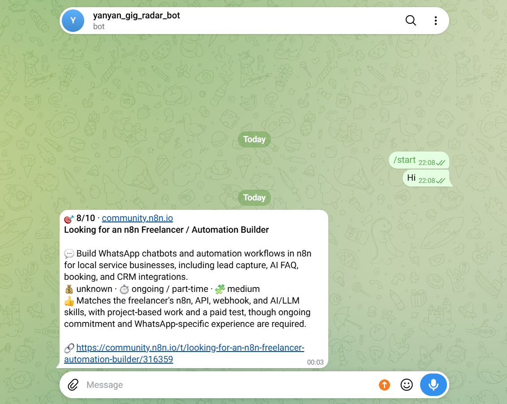
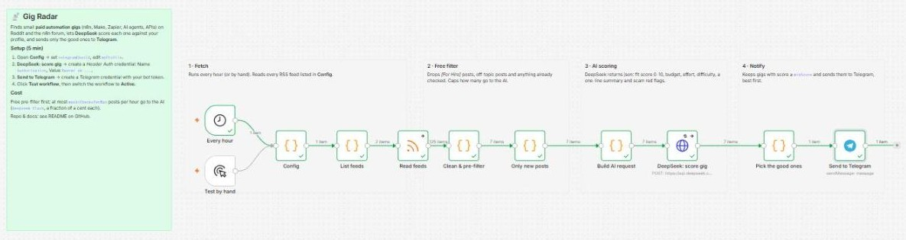
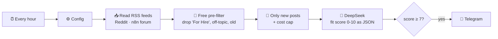

# 📡 Gig Radar

**An n8n workflow that finds small paid automation gigs for you, scores them with AI, and pings you on Telegram.**

Every hour it reads Reddit and the n8n community job board, throws away the noise for free
(people offering services, off-topic posts, things it has already seen), asks **DeepSeek** to rate
each remaining post against *your* skills, and sends only the good ones to your phone.

[中文说明 →](README.zh-CN.md)

```
🎯 9/10 · Reddit r/forhire
[Hiring] n8n expert to connect Typeform -> Google Sheets -> Slack

💬 Connect a Typeform form to Google Sheets and post new rows to Slack
💰 $150 fixed · ⏱ a few hours · 🧩 easy
👍 Small, well-defined and exactly what n8n is good at

🔗 https://www.reddit.com/r/forhire/comments/...
```

<p align="center"></p>



*Real run on n8n 2 (Windows, `npx n8n`): 125 posts fetched → 7 left after the free pre-filter → DeepSeek scored them 1–7 → 1 alert sent.*

## How it works



| Step | What happens | Cost |
|---|---|---|
| Fetch | Reads every RSS/Atom feed listed in **Config** | free |
| Pre-filter | Keeps posts that look like *someone paying for automation work*; drops `[For Hire]`/`[Offer]` posts, off-topic jobs and posts older than 48 h | free |
| Only new | Remembers what it has already checked, caps AI calls per run | free |
| AI scoring | DeepSeek returns `fit_score`, `budget`, `effort`, `difficulty`, a one-line summary and **scam red flags** | ~$0.0005 per post |
| Notify | Sends gigs with `fit_score ≥ minScore` to Telegram, best first | free |

Default sources: `r/forhire`, `r/DoneDirtCheap`, `r/slavelabour`, `r/n8n`, `r/automation`, `r/nocode`, `r/zapier`
and the [n8n community Jobs board](https://community.n8n.io/c/jobs/13). Add any RSS feed you like.

## Quick start

### 1. Run n8n

Pick one:

```bash
# Option A – Node.js (LTS) installed
npx n8n
# (Windows: or just double-click start-n8n-windows.bat)

# Option B – Docker
docker compose up -d
```

Open <http://localhost:5678> and create your local account.

### 2. Import the workflow

**Workflows → Create → ⋯ → Import from file** → choose [`workflows/gig-radar.json`](workflows/gig-radar.json).

### 3. Add your keys

| Node | Credential | What to enter |
|---|---|---|
| **DeepSeek: score gig** | *Header Auth* | Name `Authorization`, Value `Bearer sk-...` ([get a key](https://platform.deepseek.com/api_keys)) |
| **Send to Telegram** | *Telegram API* | Bot token from [@BotFather](https://t.me/BotFather) (`/newbot`) |

**Get your Telegram chat ID:** send any message to your new bot, then open
`https://api.telegram.org/bot<YOUR_TOKEN>/getUpdates` in a browser and copy the number at `"chat":{"id": …}`.

### 4. Edit Config

Open the **Config** node and change at least:

- `telegramChatId` – the number from step 3
- `myProfile` – a few sentences about your skills and the gigs you want. The AI scores every post against this text, so be specific.

Optional: `feeds`, `topicKeywords`, `minScore`, `summaryLanguage`, `maxAiChecksPerRun`, `model`.

### 5. Test, then switch on

Click **Test workflow**. If nothing arrives, lower `minScore` to `0` for one test run to see everything the AI scored.
When you're happy, click **Publish** (older n8n versions: toggle **Active**) – it now runs every hour on its own,
as long as n8n is running on your computer.

## Cost

With `deepseek-flash`, one post costs roughly **$0.0005** to score. The free pre-filter usually leaves a few
dozen posts a day, i.e. **cents per month**. Hard ceiling: `maxAiChecksPerRun` (default 15) × 24 runs/day.

## Customising

- **Another LLM:** any OpenAI-compatible API works – change the URL in *DeepSeek: score gig* and `model` in Config
  (e.g. OpenAI `https://api.openai.com/v1/chat/completions`, or a local [Ollama](https://ollama.com) at `http://localhost:11434/v1/chat/completions`).
  For models without `thinking`, remove that line in *Build AI request*.
- **Other outputs:** swap the Telegram node for Slack, Discord, email or a Google Sheet.
- **Other niches:** change `feeds`, `topicKeywords` and `myProfile` – the same workflow finds design, writing or dev gigs.

## Good to know

- **Memory only works when published/active.** n8n saves the "already seen" list only for automatic runs. Manual test runs treat every post as new – that's expected.
- **Failed AI calls are retried** on the next run instead of being lost (e.g. when your DeepSeek balance is empty).
- **Reddit rate-limits RSS.** Keep the Reddit subreddits in one combined feed (`r/a+b+c/new/.rss`) and don't run more often than every ~15 minutes.
- **Upwork and Fiverr don't offer RSS feeds**, so they are not included.
- **The AI can be wrong.** Always read the original post, and never pay a client to get a job.

## Project structure

```
workflows/gig-radar.json     ← import this into n8n
src/*.js                     ← source of each Code node (readable + testable)
scripts/build-workflow.py    ← rebuilds the workflow JSON from src/
test/code-nodes.test.js      ← runs the Code-node logic outside n8n with fixtures
docker-compose.yml           ← optional local n8n
start-n8n-windows.bat        ← Windows: double-click to start n8n
docs/                        ← screenshots
```

Edit a file in `src/`, then:

```bash
python3 scripts/build-workflow.py   # rebuild workflows/gig-radar.json
node test/code-nodes.test.js        # run the tests
```

## License

MIT
